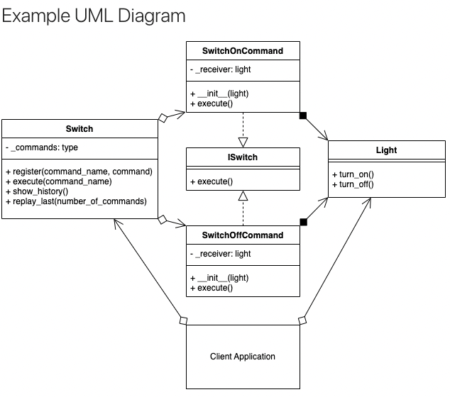

# Command Design Pattern

## Type of Pattern
The Command Design Pattern is a behavioral design pattern that focuses on encapsulating a request as an object. This object contains all the necessary information to perform an action, allowing for parameterization and decoupling of sender and receiver.

## When to Use
The Command pattern is used when you want to parameterize objects with operations, delay the execution of an operation, or queue a request for execution. It's also useful when you need to support undoable operations or provide logging and auditing capabilities.

## Pros of Using Command
- **Decouples Invoker and Receiver:** The Command pattern decouples the sender (invoker) of a request from the receiver (executor) of the request. This allows for more flexible and extensible code.
- **Supports Undo/Redo:** By encapsulating actions as objects, you can easily implement undo and redo functionality by keeping a history of executed commands.
- **Flexible Parameterization:** Commands can be parameterized with different arguments, allowing for a wide range of operations to be performed.
- **Logging and Auditing:** Since commands are objects, you can log and audit each executed command, enhancing system transparency and traceability.

## Cons of Using Command
- **Increased Complexity:** Introducing a command layer can add some complexity to the codebase, especially for simple operations.
- **Memory Overhead:** If not managed properly, storing command history for undo/redo functionality can lead to increased memory usage.

## Command and SOLID Principles
- **Single Responsibility Principle (SRP):** Commands adhere to SRP by encapsulating a single action in an object.
- **Open/Closed Principle (OCP):** New commands can be added without modifying existing code, promoting extensibility.

## Similar Pattern: Strategy Pattern
The Strategy pattern is similar to the Command pattern in that both encapsulate behavior into objects. However, there's a distinction:
- **Command:** Focuses on encapsulating and decoupling requests and their execution, allowing for delayed or queued execution, undo/redo, etc.
- **Strategy:** Focuses on encapsulating interchangeable algorithms, allowing a client to choose an appropriate algorithm at runtime.

## Main Difference
The main difference between the Command and Strategy patterns lies in their intent and use cases:
- **Command:** Primarily deals with encapsulating requests and actions, enabling delayed execution, undo/redo, and more.
- **Strategy:** Primarily addresses interchangeable algorithms, providing a mechanism for runtime algorithm selection.

## Real-Life Example

### Remote Control for Electronic Devices

In this example, we'll explore the Command pattern by creating a remote control system for various electronic devices, such as TVs, sound systems, and lights.

**Problem Statement**

Imagine you want to design a remote control system that can manage multiple electronic devices. Each button on the remote control should trigger a specific action on a specific device. You also want to support undoing the last action.

**Solution: Using the Command Pattern**

To solve this, we'll use the Command pattern. Here's how the solution might look:

1. **Command Interface:** Create a `Command` interface that defines the common `execute()` method.

2. **Concrete Commands:** Implement concrete classes that implement the `Command` interface. Each class encapsulates a specific action for a specific device.

3. **Electronic Devices:** Create classes for electronic devices like `TV`, `SoundSystem`, and `Light`. Each device will have methods like `turnOn()` and `turnOff()`.

4. **Remote Control:** Design a remote control class that has a set of slots, each associated with a button. The remote control will store instances of the `Command` interface in these slots.

5. **Client Code:** In the client code, create instances of concrete commands, associate them with the remote control slots, and press the buttons to execute commands on different devices.

6. **Undo Functionality:** To support undoing the last action, you can add an `undo()` method to the `Command` interface and implement it in the concrete command classes.

**Benefits of the Command Pattern**

By applying the Command pattern, you achieve the following benefits:
- Decoupling the remote control from electronic devices, allowing easy addition of new devices and actions.
- Supporting undo functionality by implementing the `undo()` method in concrete command classes.
- Encapsulating requests and actions, enabling delayed execution (press now, execute later).

**Code Example:**
### 01. [A Smart Light Control System](01_light_example.py)

<p align="center">
    
</p>
In this illustrative code example, we delve into the creation of a sophisticated smart light control system using the Command design pattern. This design pattern facilitates the encapsulation of commands, which are executed by invokers and interact with receivers. The structure is designed to support command history tracking, command replay, and extensibility for future enhancements.

**The Core Abstractions: Switch and Light**

At the heart of our system lies the concept of a "Switch," represented by the abstract class `ISwitch`. This interface mandates the implementation of an `execute()` method for all command objects. It serves as the common contract that all command classes need to adhere to. On the other hand, the "Light" class acts as the receiver, containing methods to turn the light on and off.

**The Invoker: Switch Class**

The "Switch" class, referred to as the invoker, is responsible for registering, executing, and managing commands. It maintains a dictionary of registered commands and their associated names. Additionally, it keeps a historical record of executed commands, including their timestamps. The `show_history()` method allows users to visualize the history of executed commands, while `replay_last()` enables the replay of the last N executed commands.

**Command Objects: SwitchOnCommand and SwitchOffCommand**

Two command classes, `SwitchOnCommand` and `SwitchOffCommand`, implement the `ISwitch` interface. Each command class takes a "Light" object as a parameter during instantiation. When executed, these commands invoke the corresponding methods (`turn_on()` and `turn_off()`) on the "Light" receiver, effectively controlling the state of the light.

**Registering and Executing Commands**

First, we create a "Light" instance. Then, we instantiate the command objects (`SwitchOnCommand` and `SwitchOffCommand`). These commands are registered on the invoker ("Switch") using the `register()` method. With commands in place, we execute them by passing their corresponding names to the `execute()` method of the invoker. This execution is effectively the switch's response to user input.

**Demonstrating History and Replay**

The `show_history()` method provides insight into the history of executed commands, showing timestamps and command names. This feature enhances transparency and troubleshooting. Additionally, the `replay_last()` method enables the replay of the last N executed commands. It is worth noting that replaying commands not only mimics user interaction but can also be recorded in the command history for full traceability.

```
This code exemplifies the power of the Command design pattern in creating a sophisticated smart light control system. The decoupling of commands, receivers, and invokers enhances modularity and extensibility. Moreover, the ability to track command history and replay past actions adds a layer of usability and diagnostic capability. As the system evolves, the design paves the way for remote control and automation through the integration of sensors and additional command variations.
```

### 02. [A Remote Control for Electronic Devices](02_home_automation.py)

In this scenario, we'll explore how the Command pattern can be applied to a home automation system. The system manages various devices such as lights, fans, and appliances through a centralized remote control. Each device can be controlled using different commands, and the system also supports undo functionality.

## Conclusion

The Command pattern provides a way to encapsulate actions and decouple requesters from performers. It's particularly useful when you want to support undoable operations, delayed execution, or when you need to separate the sender and receiver of a request.