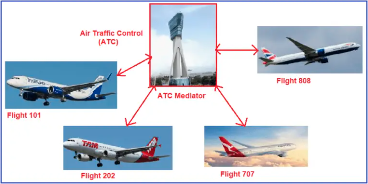
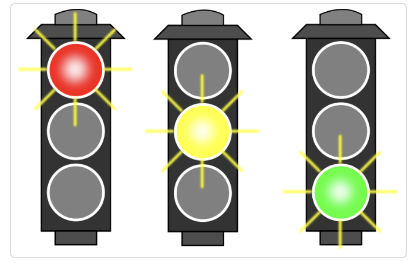
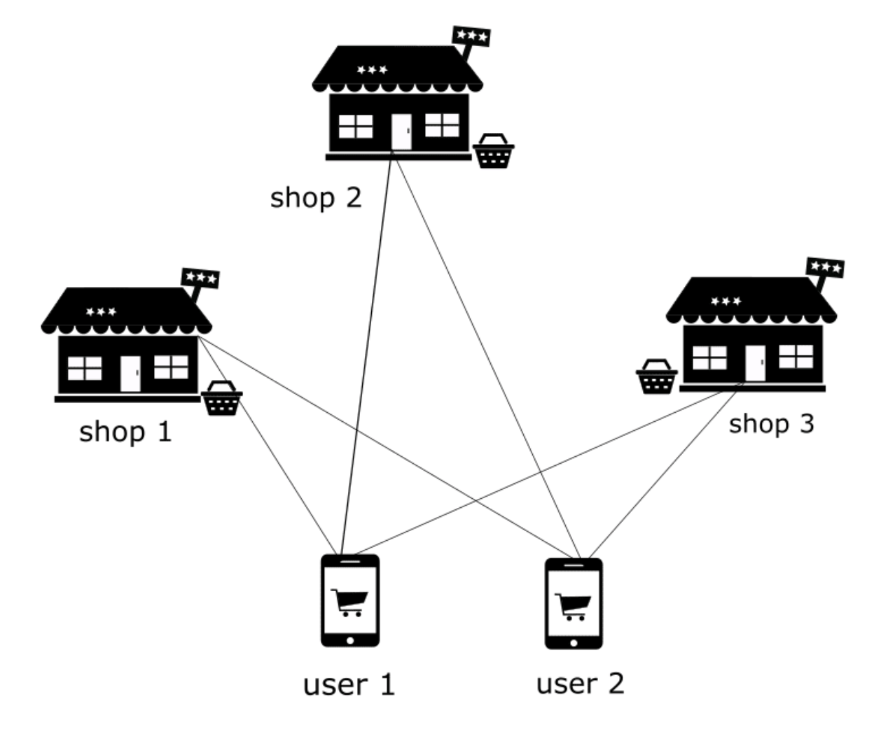
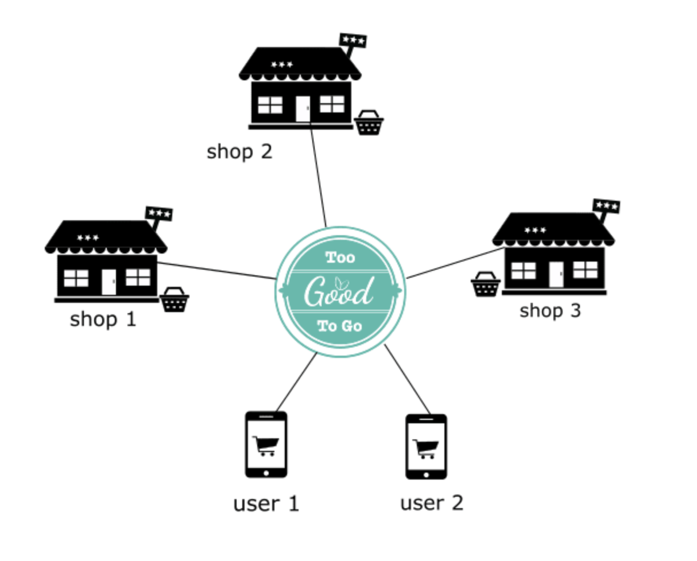
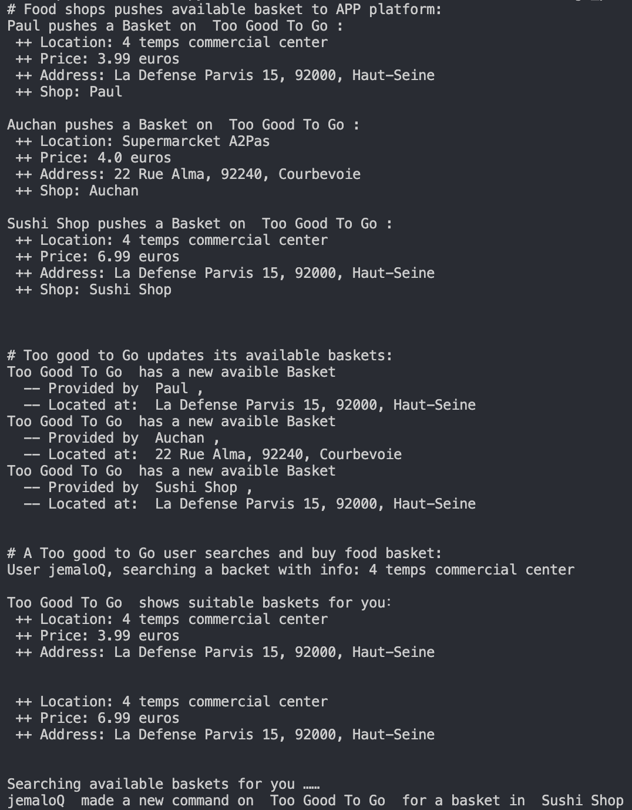

# Mediator Design Pattern

## Type of Pattern
The Mediator Design Pattern is a behavioral design pattern. It focuses on providing a central point of control and communication between multiple objects or components.

## When to Use
The Mediator pattern is used when a system involves a large number of interacting objects with complex communication and dependencies. It is particularly useful in scenarios where the direct communication between objects can lead to high coupling, making the system difficult to maintain and extend.

## Pros of Using Mediator
- **Decouples Components:** Mediator pattern promotes loose coupling between components by eliminating direct communication between them. Components only interact with the mediator, reducing dependencies.
- **Centralized Control:** The pattern centralizes control and coordination, making it easier to manage complex interactions and behavior.
- **Easier Maintenance and Extensibility:** Changes to individual components are isolated from others, making the system more maintainable and allowing new components to be added with minimal impact.
- **Promotes Reusability:** The mediator encapsulates interaction logic, which can be reused across different parts of the system.

## Cons of Using Mediator
- **Complexity:** Introducing a mediator can add an extra layer of complexity to the system, making it harder to understand if not implemented correctly.
- **Single Point of Failure:** Since the mediator becomes a central point of communication, if it fails or becomes overly complex, the entire system could be affected.

## Mediator and SOLID Principles
- **Single Responsibility Principle (SRP):** Mediator adheres to SRP by encapsulating communication logic in a single class, separating it from the individual components.
- **Open/Closed Principle (OCP):** Adding new components or modifying existing ones doesn't require changes to the mediator. The mediator can be extended to handle new interactions without modifying its core logic.

## Similar Pattern: Observer Pattern
The Observer pattern is similar to the Mediator pattern in that both involve communication between objects. However, there is a key difference:
- **Mediator:** Components communicate with each other through a central mediator. Components are aware of the mediator's existence.
- **Observer:** Objects (observers) subscribe to and receive updates from a subject (observable) without direct knowledge of other observers.

## Main Difference
The main difference between the Mediator and Observer patterns is in the direction of communication and dependency:
- **Mediator:** Components depend on the mediator and communicate through it. The mediator coordinates interactions and may encapsulate complex logic.
- **Observer:** Observers depend on the subject and receive updates from it. The subject doesn't control or coordinate the observers' behavior.

In summary, the Mediator pattern provides a structured way to manage complex interactions between components, promoting decoupling, maintainability, and extensibility. It's a powerful tool for designing systems with intricate communication needs while adhering to design principles.

# Real-Life Example

### 1) [Air Traffic Controller](04_air_traffic_controller.py)

Air traffic controller (ATC) is a mediator between flights. It helps in communication between flights and coordinates/controls landing, take-off.

Two flights need not interact directly and there is no dependency between them. This dependency is solved by the mediator ATC.

If ATC is not there all the flights have to interact with one another and managing the show will be very difficult and things may go wrong.

Mediator Design Pattern Real Life Example ATC

### 2) [Traffic Light Signal](03_trafic_lights.py)

When one light turns ON, rest other have to be turned OFF.

If each light will communicate with another lights to changes their state then it would be highly coupled and difficult to maintain.

By introducing Light Mediator which is responsible to hold object reference of all other light and communication task, the design becomes flexible and de-coupled.

We can add any color light and remove it when ever we want that too at run time. 

### 3) [Transported to the battlefield](05_transport.py)

In this example, we'll explore the Mediator Pattern, a behavioral design pattern that promotes loose coupling among components by centralizing their communication through a mediator. We'll apply this pattern to manage the interaction between transportable fighting units and transport vehicles.

**Problem Statement**

Imagine we have a first-person shooter game with controllable mechanized fighting units. Now, we want to launch an attack using these units, but they need to be transported to the battlefield using ships, helicopters, and planes. However, transportable units can't fight or move while being transported.

**Solution: Introducing the Mediator Pattern**

To address this, we'll use the Mediator Pattern. Instead of allowing direct communication between the units and transporters, we'll introduce a central controller class known as the mediator. The mediator will handle the interaction logic and communication between the units and transporters, ensuring that changes or additions to the system only affect the mediator.

**Transportable Interface**

We define a `Transportable` interface that includes methods for various states of transportable units, such as `embark()`, `disembark()`, `idle()`, and `activate()`.

**TransportUnit Interface**

Similarly, we define a `TransportUnit` interface for transport vehicles. It includes methods like `arrive()`, `depart()`, `travel()`, `start_embarkation()`, and `start_disembarkation()`.

**Mediator: HeadQuarters**

We create a mediator class called `HeadQuarters`. It encapsulates the interaction logic between transportable units and transport vehicles. It registers units and transporters, and it handles processes like embarkation and disembarkation.

**AbstractTransportableFightingUnit**

An abstract class, `AbstractTransportableFightingUnit`, implements both the `Transportable` interface and the fighting unit functionality. It communicates with the mediator to handle actions like embarkation, disembarkation, idling, and activation.

**TransportShip**

The `TransportShip` class implements the `TransportUnit` interface. It communicates with the mediator to manage the embarkation and disembarkation processes. It also has methods for arriving, departing, and traveling.

**Client Code**

The client code demonstrates how the Mediator Pattern is used. It creates instances of the mediator and various transport objects, allowing units to embark and disembark from the transporters as directed by the mediator. The centralization of communication and interaction through the mediator ensures a clean separation of concerns and minimizes inter-dependencies.

By utilizing the Mediator Pattern, we've achieved a more organized and maintainable system where units and transporters interact through a centralized mediator, promoting flexibility and ease of updates.

This pattern is particularly useful when managing complex interactions and dependencies between multiple components, ensuring that changes are localized and easier to manage.

### 4) ["Too Good To Go"](06_food_app.py)

In this example, we will explore the concept of the Mediator pattern through a real-life scenario inspired by the "Too Good To Go" application. The "Too Good To Go" app connects customers with restaurants and stores that have surplus, unsold food, with the goal of reducing food waste and promoting environmental sustainability.

**The Problem without a Mediator**

Imagine a scenario where customers want to buy unsold food baskets directly from shops without using a mediator. In this approach, customers would need to interact with each shop individually, resulting in complex interactions and potential inefficiencies.

**Introducing the Mediator: "Too Good To Go"**

Now, let's consider how the Mediator pattern can improve this process. We will model the solution using Python classes, without the actual code.

**Defining BasketInfo and BasketPlatformApp Classes**

We start by defining a `BasketInfo` class to represent food baskets. Each basket contains information about its location, price, address, and the shop offering it.

We then create a `BasketPlatformApp` class, which serves as the mediator. This class manages the interactions between customers and shops, enabling customers to query and buy available food baskets.

**Implementing BasketShop and Customer Classes**

To demonstrate the Mediator pattern, we define two participant classes: `BasketShop` and `Customer`. These classes will not communicate directly; instead, their interactions will be mediated by the `BasketPlatformApp`.

**Benefits of the Mediator Pattern**

By using the Mediator pattern, customers can now query and buy available food baskets in a more streamlined manner. The Mediator, represented by the `BasketPlatformApp`, handles the complexities of interactions between customers and shops.

R**unning the Simulation**

We run a simulation to showcase the Mediator pattern in action. Shops like "Paul," "Auchan," and "Sushi Shop" publish their available food baskets to the "Too Good To Go" platform. Customers like "jemaloQ" can search for and buy suitable baskets through the Mediator.

This simulation demonstrates how the Mediator pattern simplifies interactions between customers and shops, leading to a more efficient and organized process for querying and buying available food baskets.

By applying the Mediator pattern, we've created a more cohesive and manageable system, mirroring the real-world benefits of the "Too Good To Go" application in reducing food waste and promoting sustainability.

To visualize the whole process, check out the images in the article above.

Tutorial: https://dev.to/jemaloqiu/design-pattern-in-python-6-mediator-pattern-b7d
