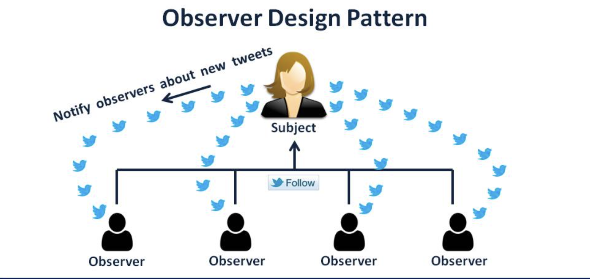
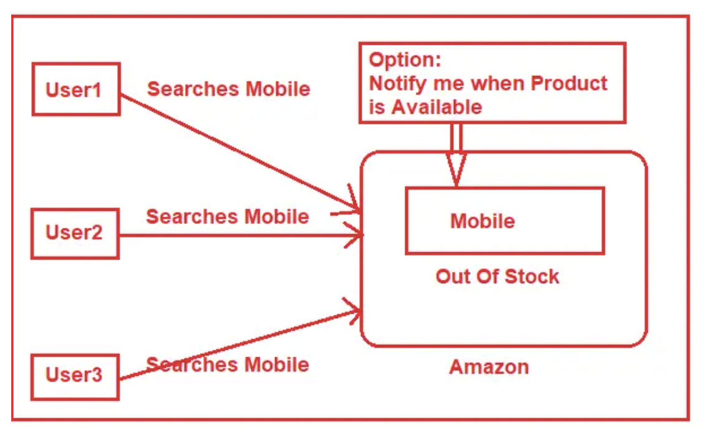
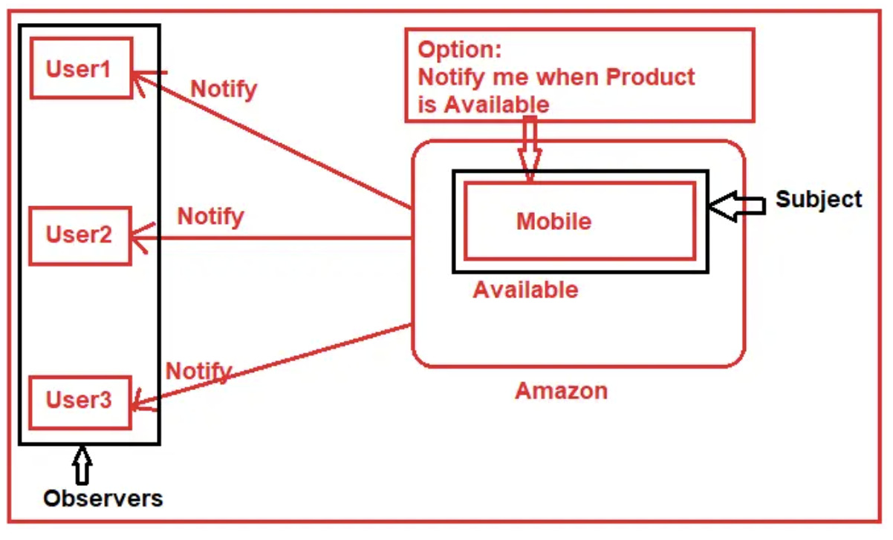

## Observer Pattern

The Observer Pattern is a **behavioral design pattern** that establishes a one-to-many relationship between objects. It enables objects (observers) to be notified and updated automatically when the state of another object (subject) changes. This pattern promotes loose coupling and is often used in scenarios where objects need to interact without having extensive knowledge of each other.

## Definition

The Observer Pattern allows a subject to maintain a list of observers and notify them of state changes. Observers are then able to react to these changes without being tightly coupled to the subject. This design enables flexibility and modularity in systems.

## When to Use

Use the Observer Pattern when:

- You have a **one-to-many relationship** between objects, where changes in one object should trigger updates in multiple other objects.
- You want to achieve **loose coupling** between objects, reducing dependencies and increasing maintainability.
- You need a mechanism to update multiple dependent objects when a single object's state changes.

### SOLID Principles

The Observer Pattern aligns with several SOLID principles:

- **Single Responsibility Principle (SRP)**: Subjects manage state, while observers handle reactions to changes.
- **Open/Closed Principle (OCP)**: New observers can be added without modifying existing subject code.
- **Liskov Substitution Principle (LSP)**: Observers can be replaced without affecting subject behavior.
- **Interface Segregation Principle (ISP)**: Observers can implement only the methods they require.
- **Dependency Inversion Principle (DIP)**: Subjects and observers depend on abstractions (observer interface).

### Similar Patterns and Differences

- **Publish-Subscribe Pattern**: A variant where publishers send messages to a broker and subscribers receive updates. Common in distributed systems.
- **Mediator Pattern**: Centralizes communication between objects through a mediator. Differs from direct observer-to-subject interaction.

**Examples**

1. **Weather Station**: Displays subscribe to a weather station for updates on temperature, humidity, etc.
2. **Stock Market**: Traders subscribe to a stock exchange to receive price change notifications.
3. **Social Media Posts**: Followers are observers, notified when users they follow create new posts.

In these examples, the Observer Pattern fosters a decoupled, extensible system where diverse objects can react to changes in a subject's state without tight interdependencies.

## Examples

[Example 01](01_twitter_follow_button.py):

Twitter Follow button:  We can think about a celebrity who has many followers on twitter. Each of these followers wants to get all the latest updates of his/her favorite celebrity. So, he/she can follow the celebrity as long as his/her interest persists. When he loses interest, he simply stops following that celebrity. Here we can think of the follower as an observer and the celebrity as a subject.

    

[Example 02](02_covid_patient.py):

John has unfortunately been infected with Covid-19 and he is being monitored closely and carefully in clinic by medical workers. They mounted several medical devices to monitor his temperature, heart rate, oxygen saturation, etc. These smart devices can transmit an alert signal if the measured value surpasses or goes below a certain threshold. Today I want to simulate this scenario using Observer pattern in Python.

[Example 03](03_notify_me.py):

As you can see in the above image, three users come to the Amazon site for buying a Mobile Phone. Unfortunately, at that time the Mobile phone is out of stock i.e. the mobile is in the Out Of Stock state. But the above three users want to buy that particular mobile phone. On the Amazon website site, there is an option called `Notify Me` when the product is not available in stock. What the above three users do is, simply click on the `Notify Me` button, so that when the product is available, the Amazon site will send a notification to them.

    

After a few days, the Product is available, and so the status of the Product is changed from Out Of Stock to Available. So, what Amazon will do is send notifications to all the users who are registered with that particular product to get product available notifications. As we already discussed the Observer Design Pattern has two main components i.e. the Subject and the Observer. In our examples, the Mobile is the Subject and three users (i.e. User1, User2, and User3) are the Observers. For a better understanding please have a look at the following image.

    

