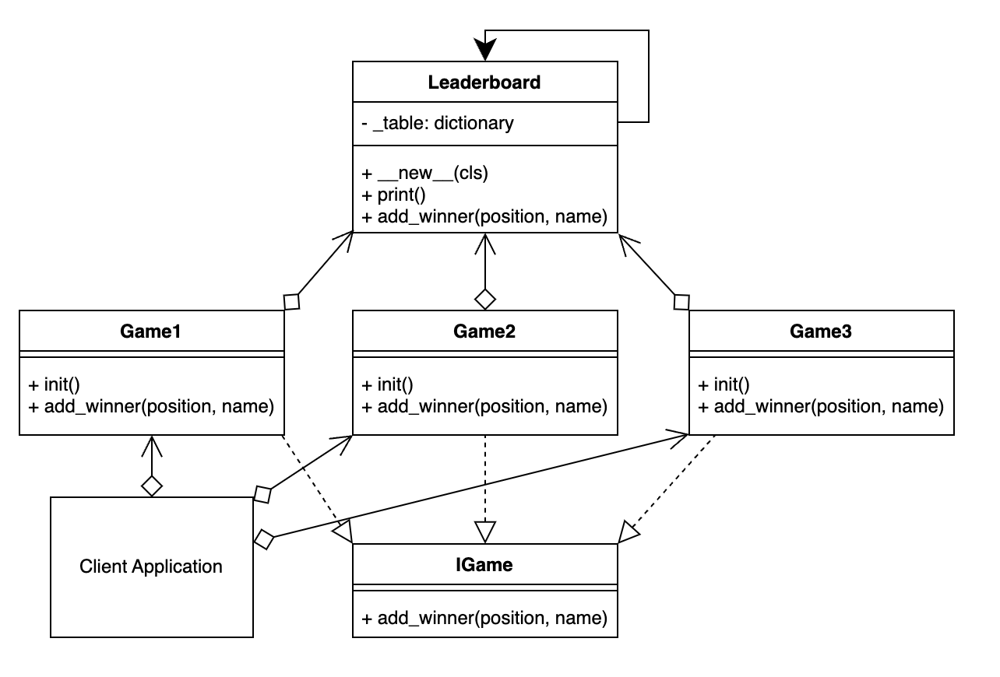

# Singleton Pattern

## Definition
The Singleton Pattern is a **creational design pattern** that ensures a class has only one instance and provides a global point of access to that instance. It restricts the instantiation of a class to a single instance and provides a way to retrieve that instance. The Singleton Pattern is commonly used to control access to a shared resource or to ensure that a class has a single point of coordination.

## Type of Pattern
The Singleton Pattern is a **creational pattern**, specifically a design pattern that deals with object creation mechanisms, trying to create objects in a manner suitable to the situation.

## When to Use
Use the Singleton Pattern when you want to ensure that a class has only one instance and provide a global point of access to that instance. This is useful when you need to control shared resources, manage a central point of coordination, or ensure that certain classes have unique instances.

## SOLID Principles
- **Single Responsibility Principle (SRP):** The Singleton class has the responsibility of managing its own instance creation, which aligns with the SRP.
- **Open/Closed Principle (OCP):** The Singleton class can be extended through inheritance, but its instance creation and access behavior remain unchanged.
- **Liskov Substitution Principle (LSP):** Singleton instances can be used interchangeably with instances of the base class if the Singleton class is designed following the LSP.
- **Interface Segregation Principle (ISP):** The Singleton pattern doesn't directly relate to interfaces, so this principle doesn't have a significant impact on it.
- **Dependency Inversion Principle (DIP):** The Singleton pattern doesn't directly deal with dependencies, but it can be used in conjunction with dependency injection techniques.

## Similar Patterns
- **Monostate Pattern:** It ensures that all instances of a class share the same state, while each instance maintains a separate identity. It's similar to Singleton in behavior but different in terms of how state is shared.
- **Multiton Pattern:** It extends the Singleton pattern to manage a map of named instances, where each instance is associated with a unique key.
- **Factory Pattern:** Factories can manage the instantiation of objects, including Singletons, but their primary focus is on creating instances, not ensuring a single instance.

## Main Difference
The main difference between Singleton and Monostate is that Singleton ensures a single instance of a class, with both shared state and identity, while Monostate ensures shared state among all instances while preserving separate identities.


In summary, the Singleton Pattern ensures that a class has only one instance and provides a global point of access to that instance. It's used to manage shared resources, coordination points, and unique instances. The pattern aligns well with the Single Responsibility Principle and Open/Closed Principle, and it finds applications in various real-world scenarios where a single point of control or coordination is needed.


## No Thread-Safe Singleton Design Pattern

The No Thread-Safe Singleton Design Pattern is a basic implementation of the Singleton pattern without any consideration for thread safety. In a single-threaded environment, this pattern ensures that a class has only one instance, but it can lead to issues in a multi-threaded environment where multiple threads may simultaneously try to create instances, leading to multiple instances being created.

Here's an example implementation of the No Thread-Safe Singleton Design Pattern in Python:

```python
class Singleton:
    _instance = None
    
    def __new__(cls):
        if cls._instance is None:
            cls._instance = super().__new__(cls)
        return cls._instance

# Usage
instance1 = Singleton()
instance2 = Singleton()

print(instance1 is instance2)  # Output: True
```

In this example, the `_instance` attribute holds the single instance of the class. However, in a multi-threaded environment, if multiple threads simultaneously check that `_instance` is `None`, they may create multiple instances, violating the Singleton pattern.

## Thread-Safety Singleton Implementation in Python

To ensure thread safety in a Singleton pattern, we need to prevent multiple threads from creating multiple instances concurrently. One way to achieve this is by using locks or synchronization mechanisms to ensure that only one thread at a time can access the instance creation process. This approach can lead to performance overhead due to lock contention.

Here's an example of a Thread-Safety Singleton Implementation using a lock in Python:

```python
import threading

class ThreadSafeSingleton:
    _instance = None
    _lock = threading.Lock()
    
    def __new__(cls):
        if cls._instance is None:
            with cls._lock:
                if cls._instance is None:
                    cls._instance = super().__new__(cls)
        return cls._instance

# Usage
instance1 = ThreadSafeSingleton()
instance2 = ThreadSafeSingleton()

print(instance1 is instance2)  # Output: True
```

In this implementation, the `_lock` ensures that only one thread at a time can access the instance creation code block. This approach guarantees that only one instance is created even in a multi-threaded environment, but it comes with the overhead of acquiring and releasing locks.

## Choosing the Right Approach

When designing a Singleton, it's important to consider the thread-safety requirements of your application. If your application is multi-threaded, using a thread-safe approach like the one shown above is crucial to avoid issues with multiple instances. However, if your application is single-threaded or the Singleton instance creation is not performance-critical, you might choose a simpler approach without thread-safety mechanisms.

It's also worth noting that modern Python versions provide built-in thread-safety mechanisms and libraries (such as `threading` and `concurrent.futures`) that can simplify thread-safe Singleton implementations and improve performance.

Always carefully assess your application's requirements and potential concurrency scenarios before deciding on the Singleton implementation approach.


## Example

[Example 01: The leaderboard](the_leaderboard.py)

In the example, there are three games created. They are all independent instances created from their own class, but they all share the same leaderboard. The leaderboard is a singleton.

It doesn't matter how the Games where created, or how they reference the leaderboard, it is always a singleton.

Each game independently adds a winner, and all games can read the altered leaderboard regardless of which game updated it.

<p align="center">
    
</p>

[Example 02: Global Settings](02_global_settings.py)

In a software application, various components may require access to global settings that affect the behavior and appearance of the application. These settings may include themes, languages, fonts, and more. Managing these settings consistently across different parts of the application is important to ensure a unified user experience.

We need a way to manage global settings that can be accessed and modified from different components of the application. However, we want to ensure that there is only one instance of the settings manager, to prevent inconsistencies and redundant storage of settings.