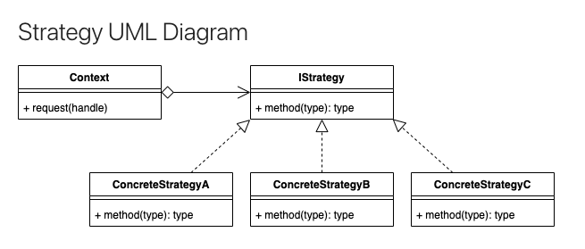

## Strategy Pattern

    

### Definition
The **Strategy Pattern** is a behavioral design pattern that allows you to define a family of interchangeable algorithms, encapsulate each algorithm in a separate class, and make these classes interchangeable. It enables clients to choose an appropriate algorithm from a set of available algorithms dynamically at runtime.

### Type of Pattern
The Strategy Pattern is a **behavioral pattern**, which means it deals with the behavior of objects, their interactions, and responsibilities.

### When to Use
Use the Strategy Pattern when you have a set of related algorithms or behaviors and want to make them interchangeable. It's useful when you need to vary the behavior of an object dynamically based on different situations or requirements.

### SOLID Principles
- **Single Responsibility Principle (SRP):** The Strategy Pattern promotes SRP by encapsulating each algorithm in a separate class, ensuring that each class has a single reason to change.
- **Open/Closed Principle (OCP):** The Strategy Pattern follows the OCP as it allows new algorithms to be added without modifying existing code. Clients can use new strategies without altering their code.
- **Liskov Substitution Principle (LSP):** The Strategy Pattern supports LSP, as the interchangeable strategies adhere to the same interface and can be used interchangeably without affecting the correctness of the program.
- **Interface Segregation Principle (ISP):** The Strategy Pattern aligns well with ISP by defining specific interfaces for each strategy, ensuring that clients only depend on the methods they require.
- **Dependency Inversion Principle (DIP):** The Strategy Pattern relies on DIP by allowing high-level modules (clients) to depend on abstractions (strategy interfaces) rather than concrete implementations.

### Similar Patterns
- **State Pattern:** The Strategy Pattern is closely related to the State Pattern, as both deal with changing behavior based on context. However, the State Pattern focuses on changing the internal state of an object, while the Strategy Pattern focuses on changing algorithms.
- **Command Pattern:** The Command Pattern encapsulates a request as an object, allowing clients to parameterize objects with actions. While similar, the Strategy Pattern focuses on interchangeable algorithms, while the Command Pattern focuses on encapsulating and invoking actions.

### Main Difference
The main difference between the Strategy Pattern and the State Pattern is in their focus and intent. The Strategy Pattern is used to interchange algorithms or behaviors, while the State Pattern is used to change the internal state of an object, affecting its behavior.

## Examples

[Exampl 1: Game Character](01_game_carachter.py)
A game character is moving through an environment. Depending on the situation within the current environment, the user decides to use a different movement algorithm. From the perspective of the object/context, it is still a move, but the implementation is encapsulated in the subclass at the handle.

In a real game, the types of things that a particular move could affect is which animation is looped, the audio, the speed, the camera follow mode and more.

